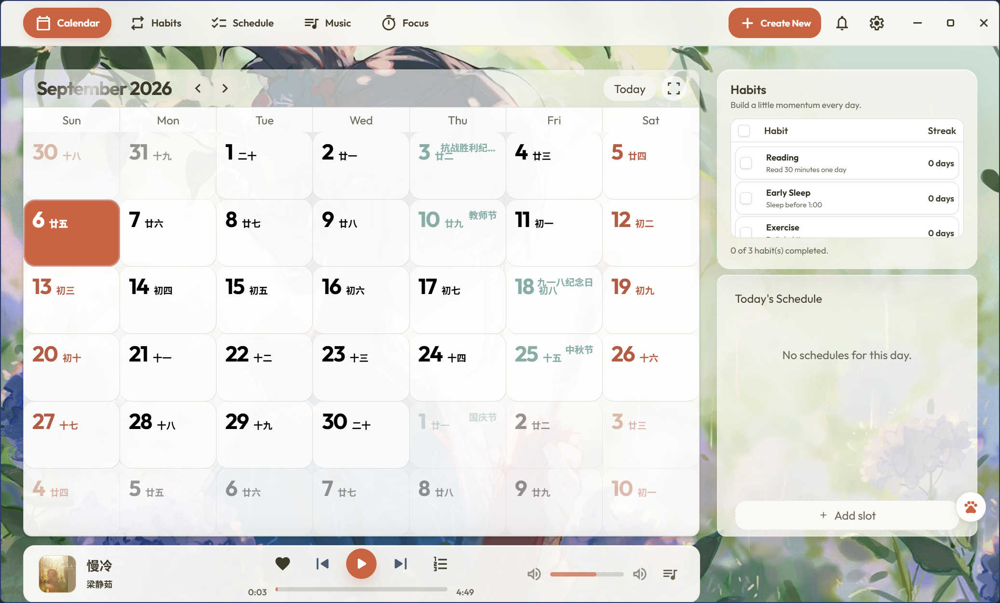
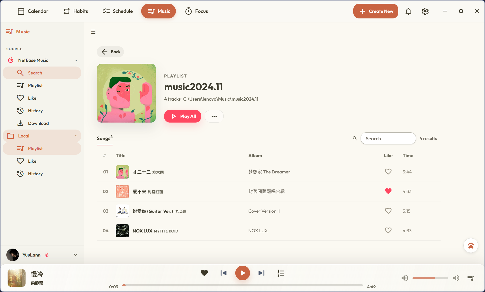
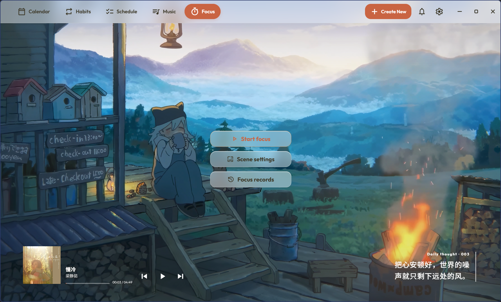
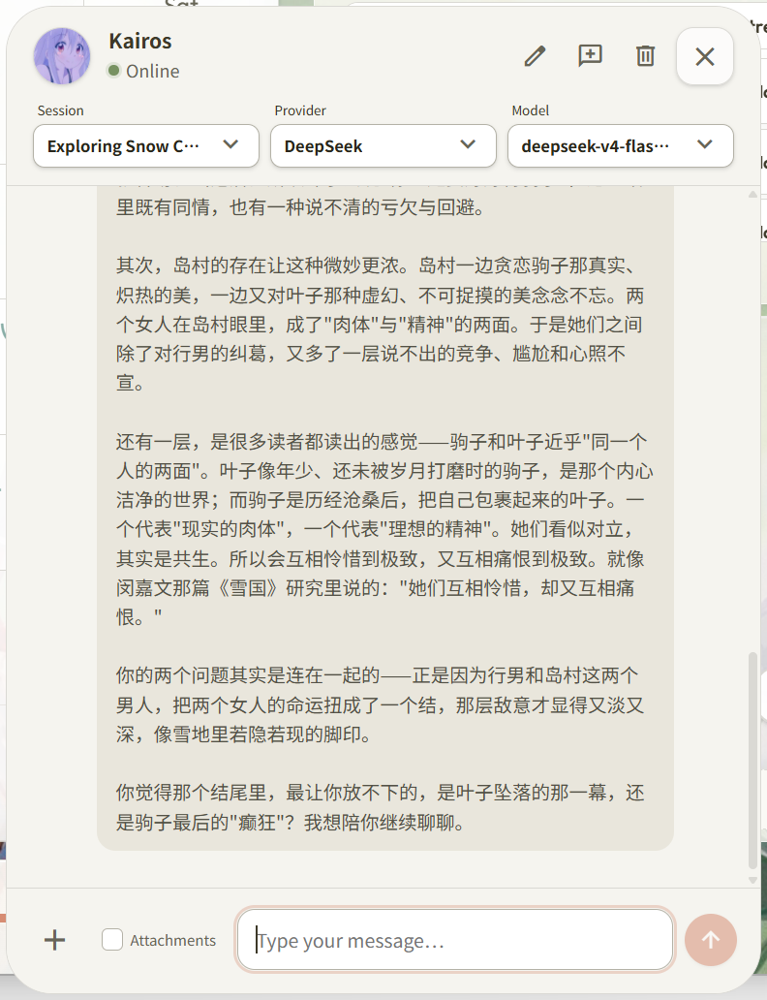
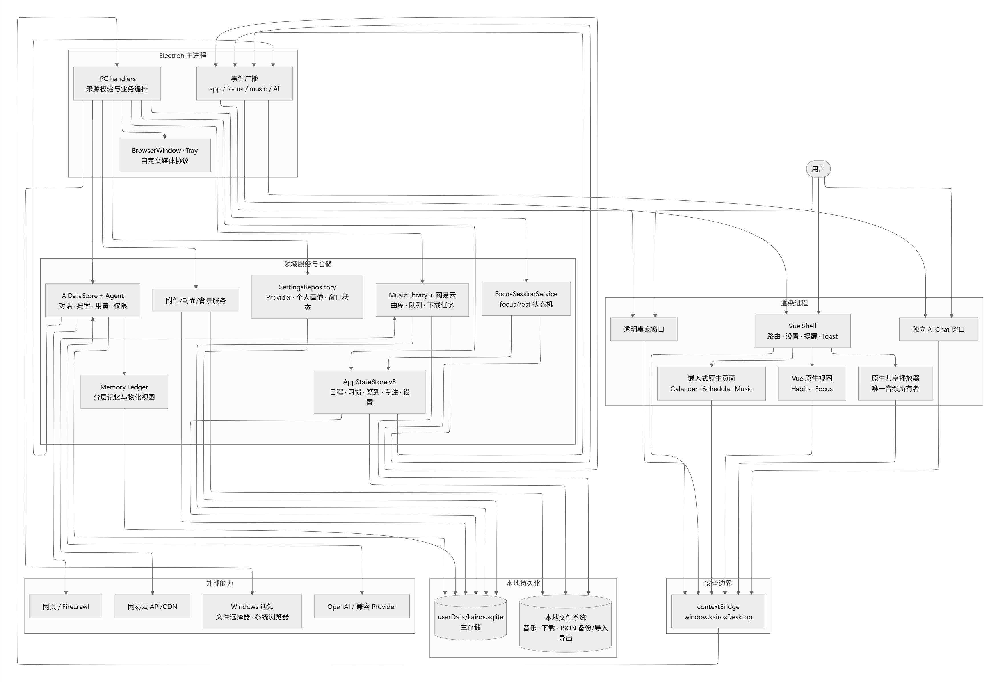

<p align="center">
  
</p>

# Kairos

[](LICENSE)
[](https://github.com/Elainaee/kairos/releases/latest)
[](https://github.com/Elainaee/kairos/releases/latest)

Kairos 是一款面向个人学习与日常规划的 Windows 桌面应用，提供日程、习惯、提醒、音乐与 AI 助手能力。

## 下载与支持平台

前往 [GitHub Releases 下载最新版](https://github.com/Elainaee/kairos/releases/latest)，在 **Assets** 中选择适合的版本：

| 版本 | 下载与使用 |
| --- | --- |
| 安装版 | 下载 `Kairos-<版本号>-win-x64-setup.exe`，运行后按向导安装。 |
| 便携版 | 下载 `Kairos-<版本号>-win-x64-portable.exe`，直接运行，无需安装。 |
| 校验清单 | 下载 `manifest.json`，使用其中的 SHA-256 核对安装版或便携版文件。 |

目前提供 **Windows x64** 安装包，已在 Windows 11 x64 上完成发行验证。macOS、Linux、Windows ARM64 与 32 位系统暂未提供经过验证的发行包。

当前 v0.1.0 未配置代码签名证书，首次运行可能出现 Windows SmartScreen 提示。请确认文件来自本项目 Release，并核对下载文件。直接使用发行包无需安装 Node.js 或 pnpm；AI 服务需要自行配置，网易云功能需要登录个人账号。

## 界面预览

### 日历

[](assets/readme/calendar.png)

### 音乐

[](assets/readme/music.png)

### 专注

[](assets/readme/focus.png)

### AI 对话

<a href="assets/readme/ai-chat.png">
  
</a>

## 技术栈

- Electron 36：桌面主进程、窗口与原生能力。
- Vue 3、Vite、Pinia：新的渲染层与状态管理。
- 原生 HTML/JavaScript：遗留功能页面，逐步由 Vue 接管。
- SQLite（`node:sqlite`）：运行时业务数据的主持久化库。
- LangChain / OpenAI：AI Agent、工具调用与记忆服务。

## 快速开始

先安装与 `package.json` 中 `packageManager` 对应的 pnpm 版本，再执行：

```powershell
pnpm install
pnpm dev
```

环境自检可运行 `pnpm doctor`。

## 常用命令

| 命令 | 用途 |
| --- | --- |
| `pnpm dev` | 同步生成资源并启动 Vite + Electron 开发环境 |
| `pnpm check` | 版本、国际化、类型与测试检查 |
| `pnpm typecheck` | Vue/TypeScript 类型检查 |
| `pnpm build:renderer` | 构建渲染进程资源 |
| `pnpm dist:win` | 构建 Windows 安装包与便携版 |
| `pnpm audit:desktop-data` | 审计应用运行时数据 |

## 文件结构

以下列出项目的主要目录与入口文件：

```text
Kairos/
├── .github/workflows/           # CI 与发行流水线
├── assets/readme/               # README 图片
│   ├── diagram.jpg             # 架构与数据流图
│   ├── calendar.png            # 日历截图
│   ├── music.png               # 音乐截图
│   ├── focus.png               # 专注截图
│   └── ai-chat.png             # AI 对话截图
├── app/                        # 原生 HTML 页面、功能模块与共享资源
│   ├── assets/                 # 背景、字体、图标、桌宠与生成样式
│   ├── features/               # assistant、calendar、habits、reminders、settings
│   ├── i18n/                   # 中英文词条与国际化运行时
│   ├── pages/                  # ai-chat、calendar、habits、music、pet、schedule
│   ├── shared/styles/          # 页面共享布局与兼容样式
│   ├── shell/                  # 导航与共享音乐播放器
│   └── themes/                 # 语义主题与主题运行时
├── renderer/                   # Vue 3 + Vite 渲染端
│   ├── src/
│   │   ├── assets/focus/       # 专注场景资源
│   │   ├── components/         # 应用外壳、设置、提醒与通用组件
│   │   ├── composables/        # 可复用组合逻辑
│   │   ├── data/               # 静态内容
│   │   ├── music/              # 原生播放器适配层
│   │   ├── router/             # 路由定义
│   │   ├── stores/             # 应用、专注、习惯与音乐等状态
│   │   ├── styles/             # 全局与专注样式
│   │   ├── views/              # 页面视图与原生页面宿主
│   │   ├── App.vue
│   │   └── main.ts
│   └── vite.config.ts
├── electron/
│   ├── main/index.js           # 生命周期、窗口、IPC 与服务编排
│   ├── preload/index.cjs       # contextBridge API
│   ├── data/                   # SQLite、应用状态与设置仓储
│   ├── services/               # AI、日历、文档、专注、音乐与网页服务
│   ├── scripts/                # 数据审计与发行验证
│   └── tests/                  # 单元、集成与发行测试
├── scripts/                    # 开发、构建、国际化、签名与资源准备
├── third_party/                # 第三方资源与许可证
├── .env.example                # 环境变量示例
├── package.json                # 依赖、命令与打包配置
├── pnpm-lock.yaml
└── tailwind.config.cjs
```

`docs/` 与 `references/` 仅在本地保存，不纳入 Git 仓库。`node_modules/`、`app/vue-preview/`、`release/` 等依赖及构建产物也不纳入源码版本。

## 架构与数据流

Vue Shell 承载导航、设置与全局组件，部分原生页面通过嵌入方式接入；共享播放器统一管理音频。渲染进程经 `contextBridge` 调用 Electron 主进程，由领域服务与仓储处理业务并写入 SQLite 或本地文件系统。

[](assets/readme/diagram.jpg)

点击图片可查看原图。

## 设计参考

| 网站 | 参考内容 |
| --- | --- |
| [TweakCN](https://tweakcn.com/) | 主题、字体与界面结构 |
| [React Bits](https://reactbits.dev/) | 动效与交互模式 |
| [shadcn/ui](https://ui.shadcn.com/) | 组件结构、状态与无障碍模式 |
| [Google Stitch](https://stitch.withgoogle.com/) | 布局与原型参考 |
| [Morphicons](https://www.morphicons.com/) | SVG 图标动效、GitHub 品牌图标与外链图标 |

## 技术参考

| 项目 | 参考内容 |
| --- | --- |
| [Netease_url](https://github.com/Suxiaoqinx/Netease_url) | 网易云音乐链接参考实现 |
| [NeteaseCloudMusicApi](https://www.npmjs.com/package/NeteaseCloudMusicApi) | 网易云音乐 API 软件包 |

## 数据与隐私

应用运行时会在 Electron 的 `userData` 目录创建 `kairos.sqlite`。其中可能含有个人日程、习惯、AI 对话、设置及音乐状态；请勿提交、公开或随意共享该目录。`.env` 文件同样不应提交。

网易云功能仅面向用户已获授权账号的个人使用；不会绕过版权、会员、地区、验证、速率限制或不可播放限制。

## 致谢

感谢上方“设计参考”中的 TweakCN、React Bits、shadcn/ui、Google Stitch 与 Morphicons，为 Kairos 提供界面、交互和图标方面的参考；感谢 Netease_url 与 NeteaseCloudMusicApi 提供技术参考。

同时感谢 Electron、Vue、Vite、Pinia、SQLite、LangChain、FFmpeg 等开源项目的维护者与贡献者，以及为本项目提供反馈和建议的使用者。第三方代码、图标、字体、图片、视频与音乐等内容的权利归各自权利人所有，使用时应遵守对应许可证和授权条件。

## 许可证与免责声明

项目代码采用 [MIT License](LICENSE)，完整授权条件与免责条款以仓库中的 LICENSE 文件为准。该许可证不代表对第三方素材或服务授予额外权利。

- 本软件按“现状”提供，不作明示或默示担保；作者责任范围以 MIT 许可证条款及适用法律为准。重要日程、对话和设置请定期备份。
- Kairos 是独立个人项目，与所引用的设计网站、技术项目及第三方服务不存在官方隶属或背书关系。
- 音乐、封面、背景和其他第三方内容仅可在获得相应授权的范围内使用；请遵守服务条款，不将本项目用于未经授权的传播或其他侵权用途。截图中的内容不构成再分发授权。
- AI 回答可能存在错误，请自行核实重要信息。启用在线模型或网页服务时，相关请求内容会发送给所配置的第三方服务，可能产生费用，并受其服务条款和隐私政策约束。
- 若发现素材署名、授权或其他问题，请通过 [GitHub Issues](https://github.com/Elainaee/kairos/issues) 联系，并提供相关说明。

