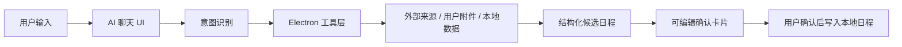

# Kairos AI Tools Spec v1.0

> 已归档：本文描述的 `searchEsportsMatches`、`fetchUrlText` 与 `ai:extract-schedules` IPC 已移除，不再是 Kairos 的运行时能力。当前工具调用统一由 LangChain Agent 管理。

> 状态：草案，阶段 1/2 已开始实现，URL 来源基础链路已接入，自动搜索候选来源已接入，外部查询 read 权限已接入  
> 范围：Kairos 桌面端 AI 助手的工具调用能力，首版聚焦“外部赛程查询 → 日程确认卡片 → 本地写入”。  
> 目标场景示例：用户输入“我想看最近瓦里 EDG 所有的比赛”，Kairos 能识别这是电竞赛程查询，而不是让模型凭空回答。

## 1. 背景与问题

当前 AI 助手已经具备基础对话、附件读取、日程提取和本地日程写入确认卡片能力，但“日程整理”仍然依赖用户提供明确来源，例如图片、文档、截图或文本。

当用户提出以下请求时，当前能力不足：

- “我想看最近瓦里 EDG 所有的比赛”
- “帮我整理 EDG 接下来的赛程”
- “把 VCT 中国赛 EDG 的比赛加到日程”

这些请求需要实时或准实时外部信息。模型本身不应该猜测比赛时间、对手和赛事名；Kairos 需要通过工具查询来源，再把结果交给 AI 和用户确认。

## 2. 设计目标

首版目标：

1. 识别用户的外部赛程查询意图。
2. 在没有来源时，明确提示需要联网工具或用户提供来源，不假装知道。
3. 在有查询工具时，查询赛事数据并返回结构化候选日程。
4. 通过可编辑确认卡片让用户决定是否写入日程。
5. 所有查询与写入默认在桌面端本地执行，不经过 Kairos 服务器。

非目标：

- 首版不做全网通用智能爬虫。
- 首版不自动写入用户日程。
- 首版不保证覆盖所有游戏、所有战队、所有赛区。
- 首版不把模型回复当作可信赛程来源。

## 3. 用户体验流程

### 3.1 没有工具或没有来源

用户输入：

> 我想看最近瓦里 EDG 所有的比赛

Kairos 应回复：

> 这类比赛赛程需要实时来源。当前还不能联网查询赛事日程；你可以上传赛程截图、网页截图、文本，或粘贴比赛列表，我会整理成可确认的日程卡片。

此时不生成空白日程卡片，不写入日程。

### 3.2 有用户提供来源

用户上传截图、文档，或粘贴赛程文本后，Kairos：

1. 提取赛程候选。
2. 展示“识别到 N 场比赛，请确认后保存”。
3. 每场比赛显示可编辑确认卡片。
4. 用户点击确认后写入本地日程。

### 3.3 有联网赛事工具

用户输入：

> 我想看最近瓦里 EDG 所有的比赛

Kairos：

1. 识别：
   - 游戏：Valorant / 无畏契约
   - 战队：EDG
   - 范围：recent 或 upcoming
2. 调用工具查询。
3. 返回结构化候选。
4. 展示确认卡片。
5. 用户确认后写入日程。

## 4. 工具调用架构

AI 对话模型不直接写业务数据。工具由 Electron 主进程提供，渲染进程只通过 preload 暴露的安全 API 调用。



### 4.1 工具分层

- Renderer / `app/ai-chat.js`
  - 负责识别基础触发词。
  - 负责展示系统提示和确认卡片。
  - 不保存密钥。
  - 不直接访问网络。

- Preload / `electron/preload.cjs`
  - 暴露白名单 API。
  - 不暴露 Node 能力。

- Main / `electron/main.js`
  - 注册 IPC。
  - 执行工具查询。
  - 访问本地存储、附件和网络。

- Tool Services / `electron/*`
  - 具体工具实现，例如电竞赛程查询、网页搜索、网页解析。

## 5. 首版工具：电竞赛程查询

### 5.1 工具名

Renderer API：

```js
window.kairosDesktop.external.searchEsportsMatches(input)
```

Main IPC：

```txt
ai:external:search-esports-matches
```

内部服务建议文件：

```txt
electron/esports-search.js
```

### 5.2 输入协议

```json
{
  "game": "valorant",
  "team": "EDG",
  "range": "recent",
  "limit": 10,
  "locale": "zh-CN",
  "timezone": "Asia/Shanghai"
}
```

字段说明：

- `game`
  - 首版支持：`valorant`
  - 可接受别名：`瓦`、`瓦里`、`无畏契约`、`Valorant`
- `team`
  - 首版支持任意字符串，但优先测试 `EDG`
- `range`
  - `recent`：最近比赛，可包含刚结束和即将开始的比赛
  - `upcoming`：未来比赛
  - `past`：已结束比赛
- `limit`
  - 默认 10
  - 最大 20
- `timezone`
  - 默认 `Asia/Shanghai`

### 5.3 输出协议

```json
{
  "status": "ok",
  "items": [
    {
      "title": "EDG vs Team Heretics",
      "date": "2026-07-05",
      "end_date": "2026-07-05",
      "start_time": "19:00",
      "end_time": "",
      "all_day": false,
      "type": "match",
      "priority": "medium",
      "status": "todo",
      "reminder": "30",
      "team": "EDG",
      "opponent": "Team Heretics",
      "game": "valorant",
      "event": "VCT",
      "source": "vlr",
      "sourceUrl": "https://example.com/match",
      "confidence": "high",
      "notes": "来源：VLR / VCT 页面"
    }
  ],
  "sources": [
    {
      "name": "VLR",
      "url": "https://example.com",
      "accessedAt": "2026-07-03T12:00:00+08:00"
    }
  ],
  "warnings": []
}
```

失败或不可用：

```json
{
  "status": "needs_source",
  "items": [],
  "sources": [],
  "warnings": [
    "当前没有可用的联网赛程查询来源，请上传截图、粘贴链接或粘贴赛程文本。"
  ]
}
```

### 5.4 日程候选到确认卡片的映射

工具返回的 `items` 直接映射到现有 schedule proposal card：

| 工具字段 | 日程字段 |
|---|---|
| `title` | `title` |
| `date` | `date` |
| `end_date` | `end_date` |
| `start_time` | `start_time` |
| `end_time` | `end_time` |
| `all_day` | `all_day` |
| `type` | `type`，应为 `match` |
| `priority` | `priority` |
| `reminder` | `reminder` |
| `notes` + `sourceUrl` | `notes` |

用户确认后仍走现有链路：

```js
desktop.tools.propose({
  conversationId,
  domain: "schedules",
  operation: "create",
  payload
})
```

然后：

```js
desktop.tools.decide({
  id: proposal.id,
  approved: true,
  payload
})
```

## 6. 信息来源策略

### 6.1 MVP 推荐顺序

首版建议按以下顺序实现：

1. 用户提供来源
   - 截图
   - 文本
   - 文档
   - 课件
   - 网页复制内容
2. 用户粘贴 URL
   - 工具抓取该 URL
   - 提取正文
   - 调模型转结构化日程
3. 自动搜索
   - 查询关键词，例如 `EDG Valorant upcoming matches`
   - 抓取前几个可信结果
   - 解析为结构化结果

### 6.2 自动搜索来源

首版可以采用 provider 结构：

```js
const providers = [
  valorantOfficialProvider,
  vlrProvider,
  liquipediaProvider
];
```

每个 provider 都实现：

```js
async function searchMatches(input) {
  return {
    items: [],
    sources: [],
    warnings: []
  };
}
```

所有 provider 的输出必须归一化为同一结构。

### 6.3 可信度

每个候选必须带 `confidence`：

- `high`
  - 明确来源
  - 明确日期
  - 明确队伍
  - 明确赛事
- `medium`
  - 来源可信，但时间或对手有部分缺失
- `low`
  - 文本解析不完整
  - 来源不稳定

低置信度候选不能默认勾选确认。

## 7. 意图识别规则

首版不需要复杂 agent planner，先用规则触发。

### 7.1 电竞赛程触发词

满足以下任意组合即可进入电竞赛程流程：

- 游戏词：
  - `瓦`
  - `瓦里`
  - `无畏契约`
  - `Valorant`
  - `VCT`
- 赛程词：
  - `赛程`
  - `比赛`
  - `对阵`
  - `最近`
  - `接下来`
  - `所有`
  - `全部`
- 队伍词：
  - `EDG`
  - 后续可扩展任意战队名

示例：

```js
const esportsScheduleIntent =
  /(瓦里|瓦|无畏契约|Valorant|VCT)/i.test(text)
  && /(EDG|[A-Z]{2,5})/i.test(text)
  && /(赛程|比赛|对阵|最近|接下来|所有|全部)/.test(text);
```

### 7.2 澄清规则

如果缺少关键信息，AI 不调用工具，先询问：

- 缺游戏：
  - “你说的是 EDG 哪个项目？无畏契约、英雄联盟，还是其他？”
- 缺范围：
  - “你想看最近已结束的比赛，还是接下来将要打的比赛？”
- 缺来源且工具不可用：
  - “我需要赛程来源。你可以上传截图或粘贴链接。”

## 8. UI 交互规格

### 8.1 工具查询状态

AI 对话流中显示系统状态：

- `正在查询 EDG 无畏契约赛程…`
- `找到 5 场比赛，请确认后保存`
- `没有找到可靠赛程来源`
- `部分比赛缺少明确时间，请确认后再保存`

### 8.2 确认卡片字段

比赛确认卡片应包含：

- 标题
- 日期
- 开始时间
- 结束时间
- 对手
- 赛事名
- 备注
- 来源链接
- 确认写入按钮
- 忽略按钮

字段可编辑。

### 8.3 批量操作

首版可选，但建议支持：

- 全部确认
- 全部忽略
- 仅确认高置信度

如果实现成本高，MVP 可以只保留逐条确认。

## 9. 权限与安全

### 9.1 本地优先

遵循既定原则：

- 桌面端直连外部来源。
- 不经过 Kairos 服务器。
- 查询结果和会话保存在本机。
- 用户确认前不写入日程。

### 9.2 权限

外部查询建议新增权限项：

```json
{
  "externalSearch": "none | read"
}
```

含义：

- `none`
  - AI 不允许联网查询。
- `read`
  - AI 可以读取公开网页或赛事来源。

写入日程仍使用已有：

```json
{
  "schedules": "write"
}
```

### 9.3 隐私边界

工具不得上传用户本地日程、附件或 API Key 到第三方搜索服务，除非用户明确把相关内容作为查询输入。

例如允许：

- 查询 `EDG Valorant upcoming matches`

不允许默认发送：

- 用户本地全部日程
- 用户附件全文
- 用户私人笔记

## 10. 错误处理

| 场景 | 行为 |
|---|---|
| 无网络 | 提示网络不可用，允许用户上传截图或粘贴文本 |
| 查询无结果 | 提示没有找到可靠结果，不生成日程 |
| 多个 EDG 分部 | 询问用户具体项目 |
| 日期缺失 | 生成低置信度候选，默认不确认 |
| 时区不明 | 默认使用 `Asia/Shanghai`，备注中标明 |
| 来源冲突 | 展示冲突来源，要求用户确认 |
| 写入失败 | 保留确认卡片并显示重试按钮 |

## 11. 实现计划

### 阶段 1：工具协议与提示闭环

文件：

- `electron/preload.cjs`
- `electron/main.js`
- `app/ai-chat.js`

内容：

- 新增 `external.searchEsportsMatches`
- 没有真实 provider 时返回 `needs_source`
- 前端显示清晰提示

验收：

- 用户输入 EDG 赛程请求时，不再静默失败。
- UI 明确提示需要来源或联网工具。

### 阶段 2：用户来源整理

文件：

- `electron/main.js`
- `electron/attachments.js`
- `app/ai-chat.js`

内容：

- 增强附件日程提取 prompt。
- 支持 `match` 类型。
- 展示比赛确认卡片。

验收：

- 上传赛程截图后能生成比赛确认卡片。
- 用户确认后写入日程。

### 阶段 3：URL 抓取

新增文件：

- `electron/web-source.js`

内容：

- 用户粘贴 URL 时抓取网页正文。
- 提取时间、战队、对手、赛事名。
- 返回结构化候选。

验收：

- 粘贴赛事页面 URL 后可以整理出日程候选。

当前实现状态：

- 已新增 `electron/web-source.js`。
- 已暴露 `window.kairosDesktop.external.fetchUrlText(input)`。
- 已支持用户在消息中粘贴 URL 后抓取网页正文，并交给 `ai:extract-schedules` 生成候选。
- 暂未做站点专用 parser 和来源可信度排序。

### 阶段 4：自动搜索 provider

新增文件：

- `electron/esports-search.js`
- `electron/esports-providers/*.js`

内容：

- 构造搜索 query。
- 从 1-2 个来源解析 EDG Valorant 赛程。
- 合并、去重、标注来源。

验收：

- 输入“我想看最近瓦里 EDG 所有的比赛”后，能返回候选比赛列表。
- 候选带来源链接。
- 不确定项目不会自动写入。

当前实现状态：

- 已新增通用搜索候选 provider。
- 当前实现使用 DuckDuckGo HTML 搜索获取候选来源 URL。
- EDG / Valorant 首版已加入 VLR 直连来源：`https://www.vlr.gg/team/1120/edward-gaming`。
- 已实现 VLR 队伍页结构化解析：可直接从 Upcoming matches / Recent Results 提取比赛日期、时间、对手、赛事名和来源链接。
- 已实现 Valorant Esports 官方页面结构化解析：可从页面内嵌 EventMatch 数据中提取 EDG 官方赛事日期、时间、对手、赛事名。
- 已将用户指定的可信来源作为优先来源：`https://www.vlr.gg/` 与 `https://valorantesports.com/zh-TW/leagues/champions,game_changers_championship,vct_masters`。
- 已新增 `externalSearch: read` 权限；前端首次联网查询会请求授权，主进程 IPC 也会拒绝未授权的外部查询。
- 赛程/赛事类请求已改为前置工具流程：识别到 URL、明确日期文本、附件日程或电竞赛程意图时，先生成确认卡片，不再先让普通聊天模型回答。
- 比赛确认卡片已补齐可编辑字段：对手、赛事名、来源链接；确认写入时会随 payload 一起保存。
- 比赛确认卡片已显示置信度与来源数量；低置信度或缺少来源时会显示警告，保存前需要二次确认。
- 多来源合并结果会在确认卡中显示来源引用，保存时保留 `sourceRefs`。
- VLR / Valorant Esports 等多来源同场比赛如果日期、时间、对手或赛事名不一致，会合并为一张候选卡并记录 `conflicts`；卡片中会展示冲突字段，保存前需要二次确认。
- 确认卡组已实现 MVP 批量操作：仅确认高置信度、全部确认、全部忽略；批量确认会复用单张卡的权限与低置信度确认逻辑。
- 已实现缺关键信息时的澄清：没有附件、URL 或明确日期时，如果用户只说 `EDG 最近比赛` 这类缺游戏项目的请求，会先询问具体项目；如果缺少 recent/upcoming 范围，会先询问范围。
- LangChain Agent 第一版已按用户要求移除：前端不再调用 `desktop.agent.run(input)`，主进程不再暴露 `ai:agent:run`，项目回到基础大模型聊天流程。
- `ai:extract-schedules` 的实现仍保留为主进程可复用函数，供后续重新搭建 Agent 或工具流时复用。
- EDG 以外的大写战队名会从用户文本中提取并传给查询工具；EDG 仍作为首版默认重点战队。
- EDG 固定可信来源存在时不再等待搜索引擎候选，避免 VLR/搜索网络波动导致长时间卡住。
- 工具返回的 sources 已补齐 `accessedAt`；比赛备注会标明时间按 `Asia/Shanghai` 显示。
- `npm run check` 已覆盖 `app/ai-chat.js`、`electron/esports-search.js`、`electron/web-source.js` 与相关测试；`KAIROS_LIVE_TESTS=1 node --test electron/esports-search.test.js` 可验证真实 VLR / Valorant Esports 来源。
- 前端会读取前 3 个候选来源正文，并交给现有 `ai:extract-schedules` 生成日程候选。
- 当 VLR 结构化解析返回候选时，前端会直接展示确认卡片，不再依赖模型从网页正文中猜测。
- VLR 与 Valorant Esports 结果会合并去重；暂未实现 Liquipedia 的结构化专用 parser。

## 12. 验收用例

### 用例 1：无工具无来源

输入：

> 我想看最近瓦里 EDG 所有的比赛

期望：

- AI 提示需要实时来源。
- 不生成空确认卡片。
- 不写入日程。

### 用例 2：上传赛程截图

输入：

> 帮我把图里的 EDG 比赛整理成日程

附件：赛程截图

期望：

- 生成比赛确认卡片。
- 类型为 `match`。
- 用户确认后写入日程。

### 用例 3：粘贴比赛文本

输入：

> EDG vs AAA 7月5日 19:00，EDG vs BBB 7月8日 17:00，帮我加到日程

期望：

- 生成 2 张确认卡片。
- 时间使用 `Asia/Shanghai`。
- 用户确认后写入日程。

### 用例 4：歧义项目

输入：

> 看一下 EDG 最近比赛

期望：

- AI 询问是无畏契约、英雄联盟还是其他项目。
- 不直接查询。

### 用例 5：自动搜索成功

输入：

> 我想看最近瓦里 EDG 所有的比赛

期望：

- 工具查询外部来源。
- 展示候选比赛。
- 每项有来源 URL。
- 用户确认后写入日程。

## 13. 后续扩展

- 支持英雄联盟、王者荣耀、CS2 等项目。
- 支持关注战队订阅。
- 支持赛程变更检测。
- 支持比赛开始前提醒。
- 支持赛果回填。
- 支持用户选择可信来源优先级。
- 支持多个来源冲突时的人工确认。

## 14. 当前建议

下一步优先实现阶段 1 和阶段 2：

1. 把工具协议接进代码。
2. 先不做自动网页搜索。
3. 让用户提供截图、文本或 URL 时能稳定整理成比赛日程。

这样可以最快补齐“AI 不会整理比赛日程”的体验断点，同时避免模型瞎编外部事实。
