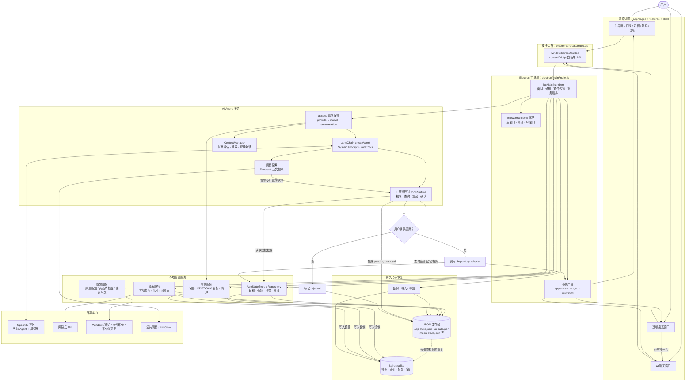
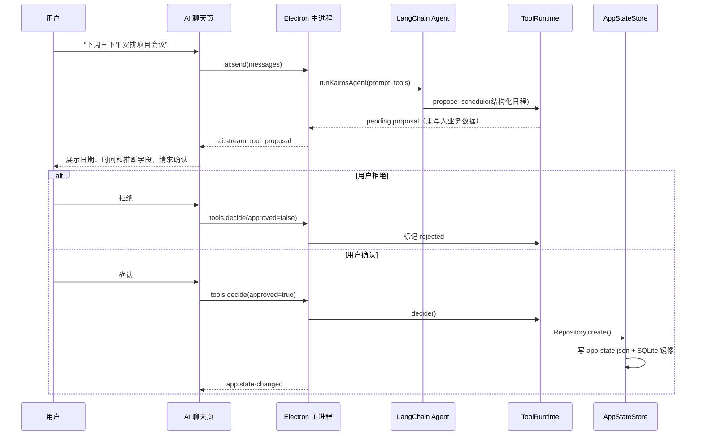

# Kairos 桌面应用：架构与数据流程图

```mermaid
flowchart TB
  User([用户])

  subgraph Renderer[渲染进程：app/pages + features + shell]
    UI[主界面：日程 / 习惯 / 笔记 / 音乐]
    Chat[AI 聊天窗口]
    Pet[透明桌宠窗口]
  end

  subgraph Bridge[安全边界：electron/preload/index.cjs]
    API[window.kairosDesktop\ncontextBridge 白名单 API]
  end

  subgraph Main[Electron 主进程：electron/main/index.js]
    IPC[ipcMain handlers\n窗口 · 通知 · 文件选择 · 业务编排]
    Windows[BrowserWindow 管理\n主窗口 · 桌宠 · AI 窗口]
    Stream[事件广播\napp:state-changed · ai:stream]
  end

  subgraph Domains[本地业务服务]
    State[AppStateStore / Repository\n日程 · 任务 · 习惯 · 笔记]
    Reminder[提醒服务\n原生通知 / 页面内提醒 / 桌宠气泡]
    Music[音乐服务\n本地曲库 / 队列 / 网易云]
    Attachment[附件服务\n保存 · PDF/DOCX 解析 · 清理]
  end

  subgraph Agent[AI Agent 服务]
    Send[ai:send 请求编排\nprovider · model · conversation]
    LC[LangChain createAgent\nSystem Prompt + Zod Tools]
    Tools[工具运行时 ToolRuntime\n权限 · 查询 · 提案 · 确认]
    Context[ContextManager\n长度评估 · 摘要 · 延续会话]
    Search[网页搜索\nFirecrawl 正文提取]
  end

  subgraph Persistence[持久化与恢复]
    JSON[(JSON 主存储\napp-state.json · ai-data.json\nmusic-state.json 等)]
    SQLite[(kairos.sqlite\n快照 · 索引 · 恢复 · 审计)]
    Backup[备份 / 导入 / 导出]
  end

  subgraph External[外部能力]
    LLM[OpenAI / 豆包\n当前 Agent 工具调用]
    Netease[网易云 API]
    OS[Windows 通知 / 文件系统 / 系统浏览器]
    Web[公共网页 / Firecrawl]
  end

  User --> UI
  User --> Chat
  User --> Pet
  Pet -->|点击打开 AI| Chat
  UI & Chat & Pet --> API --> IPC
  IPC --> Windows
  IPC --> State
  IPC --> Reminder
  IPC --> Music
  IPC --> Attachment
  IPC --> Send
  IPC --> Backup
  State & Music & Attachment --> JSON
  JSON -.丢失或损坏时恢复.-> SQLite
  State & Music & Attachment -->|写入镜像| SQLite
  Backup --> JSON
  Backup --> SQLite
  Reminder --> OS
  Music --> Netease
  IPC --> Stream
  Stream --> UI
  Stream --> Chat
  Stream --> Pet

  Send --> Attachment
  Send --> Context
  Send --> LC
  LC <--> LLM
  LC --> Tools
  LC --> Search
  Search -->|首次使用请求授权| Tools
  Search --> Web
  Tools -->|读取授权数据| State
  Tools -->|查询会话/记忆/提案| JSON
  Tools -->|生成 pending proposal| JSON
  Tools --> Proposal{用户确认提案？}
  Proposal -->|否| Reject[标记 rejected]
  Proposal -->|是| Commit[调用 Repository adapter]
  Reject --> JSON
  Commit --> State
  Commit --> Stream
```

## Agent 写入闭环

```mermaid
sequenceDiagram
  participant U as 用户
  participant R as AI 聊天页
  participant M as Electron 主进程
  participant A as LangChain Agent
  participant T as ToolRuntime
  participant D as AppStateStore

  U->>R: “下周三下午安排项目会议”
  R->>M: ai:send(messages)
  M->>A: runKairosAgent(prompt, tools)
  A->>T: propose_schedule(结构化日程)
  T-->>M: pending proposal（未写入业务数据）
  M-->>R: ai:stream: tool_proposal
  R-->>U: 展示日期、时间和推断字段，请求确认
  alt 用户拒绝
    U->>R: 拒绝
    R->>M: tools.decide(approved=false)
    M->>T: 标记 rejected
  else 用户确认
    U->>R: 确认
    R->>M: tools.decide(approved=true)
    M->>T: decide()
    T->>D: Repository.create()
    D->>D: 写 app-state.json + SQLite 镜像
    M-->>R: app:state-changed
  end
```
